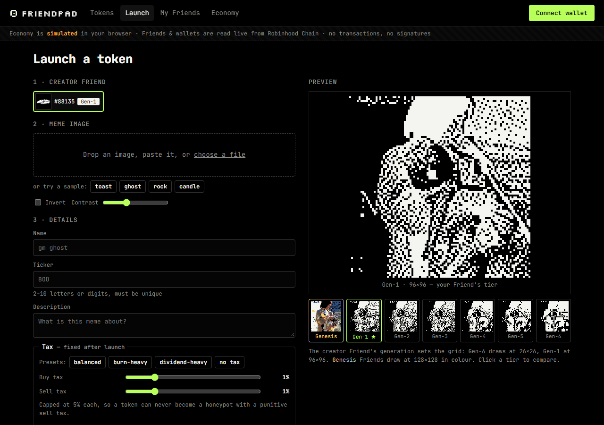
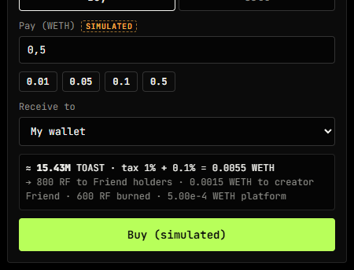
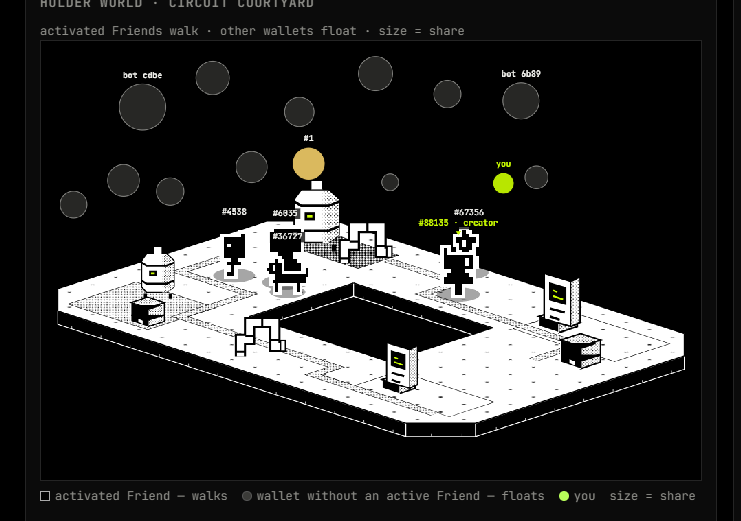
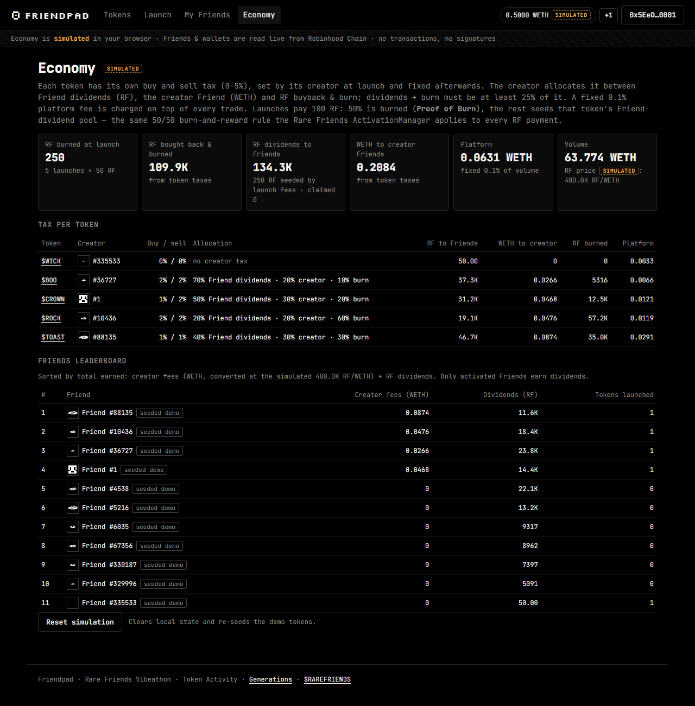
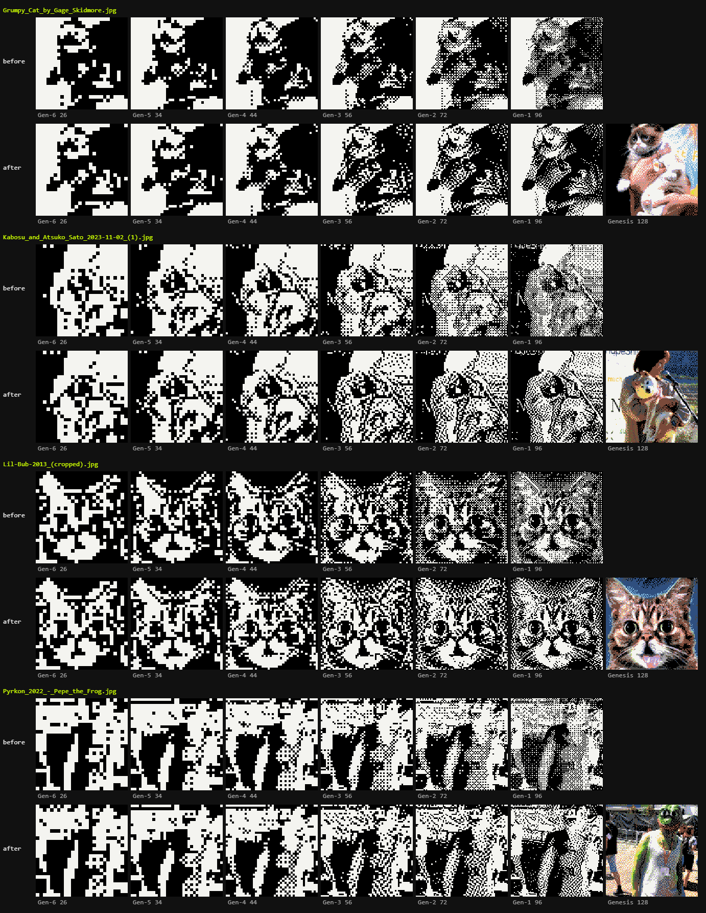

# Friendpad

**Every token is launched, drawn and held by a Rare Friend.**

Friendpad is a memepad for Rare Friends: an activated Friend's own ERC-6551 wallet launches the token and pays a 100 RF launch fee (half burned, half seeded into RF dividends), the Friend's generation decides how sharp the meme is drawn, and only Friend wallets holding the token earn $RAREFRIENDS dividends.

Rare Friends Vibeathon submission · category **Token Activity**.

- **Live demo:** https://albertgit360.github.io/friendpad/ (no install; works without a wallet in view-only mode)
- **Source:** https://github.com/AlbertGit360/friendpad
- **Stack:** not built on the FriendSDK game runtime — vanilla TypeScript compiled to ES modules + [viem](https://viem.sh) 2.21.54, static site, no bundler. The holder world reuses FriendSDK v0.1.2's world renderer and movement modules (vendored, see Credits).
- **Wallet / network:** any injected EIP-1193 wallet (MetaMask, Rabby, …) on Robinhood Chain mainnet (chainId 4663). The wallet is only asked for its address — **no transactions, no signatures, no RF needed**. To launch you need an **activated** Rare Friend (hardwired Generations NFT, gen ≥ 1, or Genesis) — activate it on [rarefriends.com](https://rarefriends.com). Without a wallet everything is browsable read-only; `?dev=1` lets you launch from any Friend you look up.



## How to use it

1. Open the demo and browse the seeded tokens (no wallet needed). Every token page shows its chart, trades, tax and the **holder world**.
2. **Connect wallet** (top right). Friendpad reads your address and lists your Friends from chain; new users get 1 simulated WETH (**+1** tops it up).
3. **My Friends** shows each Friend's generation, tier, reward weight, activation status and ERC-6551 wallet (deployed or not).
4. **Launch**: pick an activated Friend, drop/paste/upload an image (or try a sample). The preview defaults to *your Friend's* generation; click the other tiers to compare. Set name, ticker, tax and allocation, optional creator buy + lock → **Launch** (100 RF fee, simulated).
5. **Buy** on the token page, into *My wallet* or directly into one of your Friend wallets. Your holding appears in the holder world (a green `you` ball; activated Friends walk as their on-chain sprite).
6. **Your positions**: *Move to Friend*, *Sell from Friend*, *Move out* and *Claim* RF dividends. Each opens the **real `execute(...)` calldata** the Friend wallet would send in production, then applies the change to the simulation.
7. **Economy** shows RF burned, RF paid to Friends, creator fees, per-token tax and the Friends leaderboard. **Reset simulation** re-seeds the demo.

| Buy | Holder world grows | Economy |
|---|---|---|
|  |  |  |

## Real vs simulated

| Real (read live from Robinhood Chain) | Simulated (in your browser's `localStorage`) |
|---|---|
| Friend ownership, generation, Genesis/Generations collection | RF / WETH balances, launch fee |
| Tier and reward weight (`ActivationManager.positions`), activation status | Bonding curve, trades, trading bots |
| Friend wallet address (`tokenBoundAccount`) and whether it is deployed (`eth_getCode`) | Token tax, RF buyback & burn, dividends, creator fees, platform fee |
| On-chain sprites (`tokenURI`) | RF price (400,000 RF per WETH) |

Nothing is ever sent on-chain: no transactions and no signatures. Calldata is built with viem only to show what production would send.

> ⚠️ **The economy is simulated.** Launch fees, the bonding curve, trades, bots, tax, RF buyback & burn, dividends and creator fees all live in your browser (`localStorage`). Everything simulated is labelled `SIMULATED` in the UI.
> **Friends are real.** Ownership, generation, tier, reward weight, activation status, Friend wallets (ERC-6551) and sprites are read live from Robinhood Chain.
> **Friendpad never sends a transaction and never asks for a signature.** The wallet is used only to learn your address.

## Run locally

No build step, no `npm install`. Any static server works:

```bash
git clone https://github.com/AlbertGit360/friendpad.git
cd friendpad
python -m http.server 8000      # or: npx serve -l 8000
# open http://localhost:8000
```

On Windows just double-click `start.bat` — it runs a tiny built-in PowerShell server (`serve.ps1`), no Python or Node required.

`viem` is loaded at runtime from a pinned CDN build (`esm.sh/viem@2.21.54`, see the import map in `index.html`), so the page needs internet access.

Source is TypeScript in `src/`; the compiled ES modules in `js/` are committed so the site can be served as-is (e.g. GitHub Pages). To rebuild after editing: `npx -p typescript@5 tsc -p .` (or a global `tsc`); commit both `src/` and `js/`.

Useful flags: `?dev=1` lets you launch from any Friend you looked up (for testing without an activated Friend). **Economy → Reset simulation** re-seeds the demo.

## Seeded demo data

So the site is not empty, five demo tokens ($TOAST, $ROCK, $BOO, $WICK, $CROWN) with trading history are generated on first load. Their creators and several holders are **real Friends** (real tokenIds, sprites, generations and reward weights read from chain), but these Friends' owners never used Friendpad: every seeded balance and trade is **demo data only**, marked `seeded demo` / `demo` in the UI. Plain holders are simulated bots (`bot`).

## How it ties into Rare Friends / $RAREFRIENDS

| | Where it comes from |
|---|---|
| Collection | `RareFriendsGenerations` `0x14c4…181d` (verified on Blockscout) — not enumerable |
| Your Friends | Blockscout NFT index `/api/v2/addresses/{addr}/nft` + `temporaryFriend(holder)`; any tokenId can be looked up manually and checked with `ownerOf` |
| Generation | `generation(tokenId)` — 0 = temporary, 1…6 (Gen-n costs 10^(6−n) RF to hardwire) |
| Tier, reward weight, activation | `ActivationManager.positions(collection, tokenId)` → `(tier, weight)`; `weight > 0` = activated / earning |
| Friend wallet | `tokenBoundAccount(tokenId)` (ERC-6551 registry `0x0000…5758`, salt 0) + `eth_getCode` to show whether it is deployed |
| Sprite | on-chain `tokenURI` → JSON → base64 SVG |
| $RAREFRIENDS | `0x0779…b71f` (confirmed via `collection.token()`), WETH `0x0bd7…ad73` (from `ActivationManager.weth()`) |
| Chain | Robinhood Chain mainnet, chainId **4663**, RPC `https://rpc.mainnet.chain.robinhood.com` |

## Mechanics

- **Launch from a Friend.** Only activated Friends can launch. The token creator is the **Friend's wallet**, not the human.
- **Generation = resolution.** The uploaded image is pixelized in the collection's 1-bit style. Gen-1 draws at 96×96, Gen-6 at 26×26, and the better the generation, the sharper the meme: area-weighted downsampling and level normalization, then **Atkinson error diffusion** for Gen-1…3 (clean flats, crisp edges) and ordered Bayer dithering for Gen-4…6. The preview opens on your Friend's own tier and lets you compare all tiers. Comparison on real photos (before = old Bayer-everywhere pixelizer):

  
- **Genesis = colour.** Rare Friends Genesis holders (1,000,000 RF denomination) get a tier above Gen-1: 128×128 and drawn in a 13-colour palette (FriendSDK `GAME_PALETTE` + the collection's black/white/signal green + shading tones) with Atkinson colour error diffusion. The seeded `$CROWN` token is launched by the real, activated Genesis #1.
- **Proof of Burn.** Launch fee 100 RF: 50% burned, 50% seeds the token's Friend-dividend pool. This mirrors the rule the Rare Friends `ActivationManager` applies to every RF payment (`_pay`: burn half, stream half as rewards).
- **Optional creator buy at launch.**
  - The creator can buy up to **20% of supply** as the **first trade on the curve**, executed atomically with the launch before any other trade (no sniping, no bots in between). **No tax** on this buy.
  - The tokens go **straight into the creator Friend's wallet** (not the human's wallet), so they earn RF dividends like any Friend holding.
  - Optional **lock: none / 1d / 7d / 30d**. While locked, *Sell from Friend* and *Move out* are disabled for those tokens, and cards and the token page show a `Creator locked Nd` badge.
  - **Paid in WETH only, not RF.** The curve is priced in WETH, so an RF payment would have to be swapped RF → WETH first. Every creator buy would then become a market sell of RF, i.e. sell pressure on $RAREFRIENDS. RF is only ever *spent* in ways that burn it or pay it to Friends (launch fee, buyback & burn, dividends).
  - Seeded demo: `$BOO`'s creator bought 0.25 WETH at launch with a 30-day lock.
- **Bonding curve** in WETH (constant product with virtual reserves), buy / sell, price chart, trade feed with simulated bots.
- **Per-token tax, set by the creator at launch.**
  - Separate **buy** and **sell** tax, each **0–5%**. The cap keeps a token from turning into a honeypot with a punitive sell tax.
  - The creator splits the tax (must total 100%) between **Friend dividends** (always paid in RF, only to activated Friend wallets), the **creator Friend** (WETH to its own wallet) and **RF buyback & burn**.
  - **Ecosystem floor:** Friend dividends + RF burn must be at least **25%** of the tax, so every taxed token keeps feeding Rare Friends holders and RF scarcity.
  - A fixed **0.1% platform fee** is charged on every trade **on top** of the creator tax (not part of the 100%).
  - Presets: *balanced* (default: 1% / 1%, 40% dividends / 30% creator / 30% burn), *burn-heavy*, *dividend-heavy*, *no tax*. Token cards show `Tax X% / Y%` and a warning badge when the sell tax exceeds the buy tax or any tax is above 3%.
  - Taxes are **fixed after launch** (read-only in the simulation). In production the token contract would allow taxes to be **lowered, never raised**.
  - Seeded demo configs: `$TOAST` 1% / 1% balanced · `$ROCK` 2% / 2% burn-heavy · `$BOO` 2% / 2% dividend-heavy · `$WICK` 0% / 0% · `$CROWN` 1% / 2% (shows the sell > buy warning).
  - Defaults and bounds live in `src/config.ts` (`DEFAULT_TAX`, `TAX_PRESETS`, `ECON.maxTax`, `ECON.ecosystemFloor`, `ECON.platformFee`).
- **Friends-only dividends.** Only tokens sitting *inside the wallet of an activated Friend* (on-chain reward weight > 0) earn; non-activated Friends show “Activate to earn”. Weight = balance × boost from the Friend's on-chain reward weight; minimum balance set at launch; dividends-per-share accounting so you only earn from fees after you entered. Destination wallets are verified by recomputing `tokenBoundAccount(tokenId)` — never by trusting `token()` on an arbitrary address.
- **Holder world.** Every token gets one of the FriendSDK isometric locations. Holders whose wallet belongs to an **activated** Friend walk around it as that Friend's canonical on-chain sprite (FriendSDK sprite registry `0x246E…eB8D`, SDK movement and path finding); wallets without an active Friend float above as balls. Size ∝ √share, the creator Friend is marked, top 24 holders shown plus a full holder list.
- **Claim / Move to Friend / Sell from Friend** build **real** `execute(...)` calldata with viem and show it (“would be sent in production”).
- **Simulate promotion** re-draws a meme one generation sharper (on-chain, `ActivationManager.promote()` exists for real).

## The Friend wallet (ERC-6551) — why the Friend “owns” the token

`TokenBoundAccount.execute(address to, uint256 value, bytes data, uint8 operation)`:

- callable only by `owner()` = current `ownerOf(tokenId)`, directly (no meta-transactions);
- only `operation == 0` (CALL); DELEGATECALL / CREATE / CREATE2 revert with `UnsupportedOperation`; `to == 0` reverts;
- control follows the NFT: sell the Friend and its wallet — creator fees, dividends and meme bags — goes with it.
- **Claim** shows the real calldata — `execute(<Friendpad token>, 0, claimDividends(<token>), 0)` (creator fees: `execute(WETH, 0, transfer(owner, amount), 0)`) encoded with viem — and states that it would be sent from the Friend owner's wallet in production. Nothing is sent. Contracts that don't exist yet (factory, dividend distributor) use the placeholder address `0x…f00d`.
- Move to Friend / Sell from Friend / Claim are disabled for Friends whose wallet is not deployed yet (temporary Friends) — “Wallet not deployed — hardwire on rarefriends.com”.

## Economy at a glance (all simulated)

| | Rule |
|---|---|
| Launch fee | **100 RF** per token: **50 RF burned** (“Proof of Burn”), **50 RF** seeded into that token's Friend-dividend pool — the same 50/50 burn-and-reward split `ActivationManager._pay` applies to RF payments |
| Trade tax | Set by the creator at launch, fixed afterwards: buy and sell **0–5%** each. Default **1% / 1%**, split **40% Friend dividends (paid in RF) / 30% creator Friend (WETH) / 30% RF buyback & burn**. Dividends + burn ≥ 25% of the tax |
| Platform fee | 0.1% of every trade, on top of the tax |
| Dividends | Only tokens held **inside the wallet of an activated Friend** (on-chain reward weight > 0) with at least the token's minimum balance earn. Weight = balance × (1 … 2× boost, log-scaled on the Friend's reward weight). Dividends-per-share: you earn only from fees after you entered |
| RF price | Fixed at **400,000 RF per WETH** to convert WETH tax into RF buybacks and dividends |
| Curve | Constant product with virtual reserves (3 WETH / 1.073B tokens), 800M of 1B supply on the curve, “graduates” at 12 WETH (graduation itself is future work) |
| Creator buy | Optional, ≤ 20% of supply, first trade on the curve, untaxed, WETH only, lands in the creator Friend's wallet, optional 1 / 7 / 30-day lock |

There are no random outcomes, odds or consumables. All constants live in `src/config.ts`.

## Contracts and addresses (Robinhood Chain mainnet, 4663)

| Contract | Address |
|---|---|
| Rare Friends Generations (ERC-721) | [`0x14c49e6118f46525de9ab41a51cbaa3c6ebf181d`](https://robinhoodchain.blockscout.com/address/0x14c49e6118f46525de9ab41a51cbaa3c6ebf181d) |
| Rare Friends Genesis | [`0x116eaa62241751e0c98da43d458600c6c17cd361`](https://robinhoodchain.blockscout.com/address/0x116eaa62241751e0c98da43d458600c6c17cd361) |
| ActivationManager | [`0xd4a35e11318e3679168d409184b788bcf9f283ac`](https://robinhoodchain.blockscout.com/address/0xd4a35e11318e3679168d409184b788bcf9f283ac) |
| $RAREFRIENDS (RF) | [`0x0779369854d3ecdea927206718ffd7730c67b71f`](https://robinhoodchain.blockscout.com/token/0x0779369854d3ecdea927206718ffd7730c67b71f) |
| WETH | [`0x0bd7d308f8e1639fab988df18a8011f41eacad73`](https://robinhoodchain.blockscout.com/address/0x0bd7d308f8e1639fab988df18a8011f41eacad73) |
| ERC-6551 registry | [`0x000000006551c19487814612e58FE06813775758`](https://robinhoodchain.blockscout.com/address/0x000000006551c19487814612e58FE06813775758) |
| TokenBoundAccount implementation | [`0xED038886c002B285EB0f74971e967B02F6af8ea5`](https://robinhoodchain.blockscout.com/address/0xED038886c002B285EB0f74971e967B02F6af8ea5) |

Only the public RPC (`https://rpc.mainnet.chain.robinhood.com`) and the public Blockscout API are used — no API keys.

## Checks

- `tsc -p .` (strict) compiles cleanly; `js/` is the committed output.
- Pixelizer checked by eye on four real meme photos (Grumpy Cat, Kabosu/Doge, Lil Bub, Pepe cosplay) — see the comparison image above; sharpness and legibility increase Gen-6 → Gen-1 → Genesis.
- Browser checks (Chrome, desktop): seeded tokens render; launch preview defaults to the creator Friend's tier; buy updates chart, trades and holder world; floating wallets never cover walking Friends or labels; Economy page; reload on `#/token/…` keeps the route.
- Deployed GitHub Pages site checked in a fresh browser profile without a wallet: viem loads from esm.sh, RPC and Blockscout reads work (CORS), Friend lookup works, hash routes survive a reload.
- Not automated: there is no unit-test suite. Screenshot/browser checks used a read-only mock wallet (address only); the Move to Friend → Claim flow with a real wallet holding an activated Friend is not covered by these checks.

## Known limitations

- **The simulation lives in your browser's `localStorage`.** It is per browser, not shared, and a cleared browser loses it (Economy → Reset simulation re-seeds).
- **Seeded tokens are demo data.** They use real Friends as creators/holders, but those owners never used Friendpad (marked `seeded demo` / `demo`).
- Temporary (not hardwired) Friends have no deployed wallet (`hardwire` deploys it); Friendpad disables Move to Friend / Sell from Friend / Claim for them. Reason: a temporary Friend is burned automatically when its holder drops below 1 RF, and a new one gets a new tokenId. Tokens sent to the counterfactual wallet of a burned temporary Friend could never be moved again — nobody can ever own that tokenId to call `execute()`.
- A seller can empty the Friend wallet right before selling the NFT; marketplaces can protect buyers by checking the wallet's `state()`.
- If a Friend NFT is staked in a contract, that contract becomes the wallet owner.
- Any NFT transfer clears the Friend's activation (`clearActivation`), so a sold Friend must be re-activated before launching again.
- Uploaded images are not moderated; a production launchpad needs image moderation.
- Public RPC and Blockscout API are rate-limited; very large portfolios are capped to the first 40 Friends.

## Future work

Real contracts: token factory, bonding curve, dividend distributor and graduation to a DEX pool paired with WETH; on-chain enforcement of the creator-set tax (lower-only) and of the creator-buy lock; image moderation; legal review of the tax and dividend model.

## Credits

- [viem](https://github.com/wevm/viem) (MIT), loaded from [esm.sh](https://esm.sh).
- World presets, world renderer, movement and path finding vendored unmodified from **FriendSDK v0.1.2** (`vendor/friendsdk`, Apache-2.0; world artwork: Rare Friends Isometric World Assets, see `vendor/friendsdk/provenance.json` and `NOTICE.md`). Genesis palette based on FriendSDK `GAME_PALETTE`.
- Character artwork: canonical Rare Friends Generations / Genesis sprites, read on-chain.
- Fonts: JetBrains Mono and Silkscreen (SIL Open Font License) via Google Fonts.
- Photos used only in `docs/pixelizer-comparison.png` (Wikimedia Commons): “Grumpy Cat” by Gage Skidmore (CC BY-SA 3.0), “Kabosu and Atsuko Sato” by Asanagi (CC0), “Lil-Bub-2013 (cropped)” by Joyful Noise Recordings (CC BY-SA 4.0), “Pyrkon 2022 – Pepe the Frog” by Tomasz Molina (CC BY-SA 4.0). The comparison image is shared under CC BY-SA 4.0.
